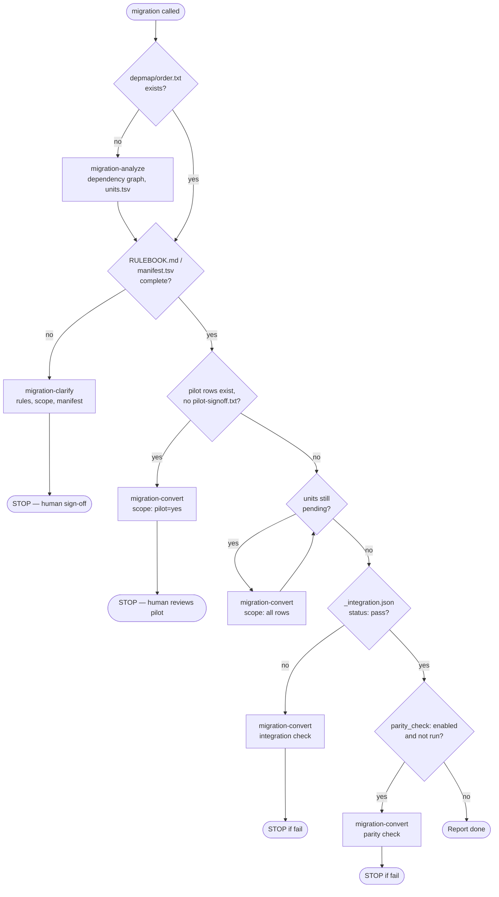
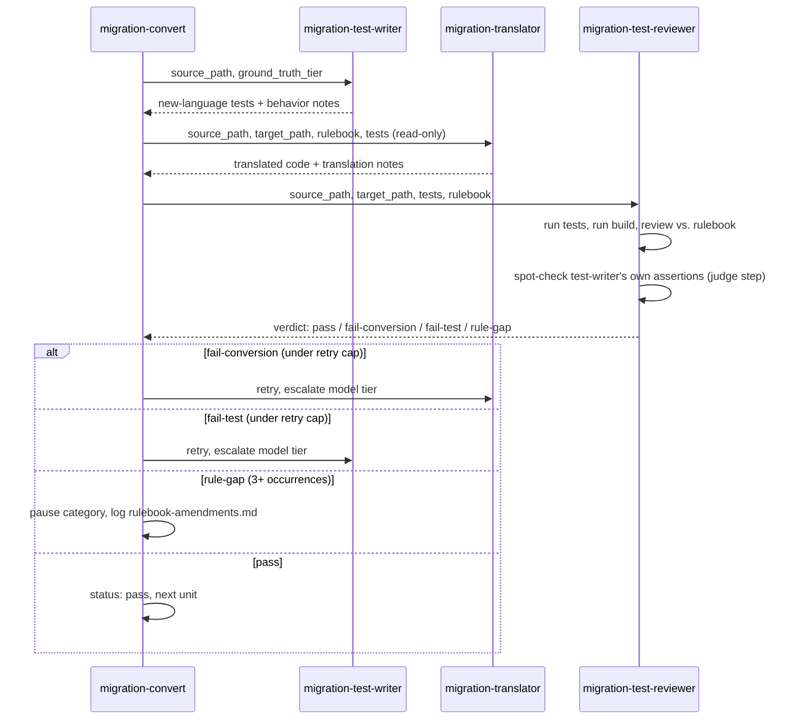

# CodeMigration

A Claude Code "migration kit" for porting a batch of similar legacy
applications (e.g. VB6, Delphi) to a new language (e.g. Java, Python), driven
entirely through a layered skill system under `.claude/`. This README focuses
on how the **migration pipeline itself** is designed — the part you own and
maintain. Department-owned domain knowledge (`domain-*` skills) is covered
only briefly at the end, since those are meant to be written and maintained
by each department, not by you.

## Design principles

- **One skill, one responsibility, one state machine.** The pipeline is a
  strict state machine over files on disk. Every skill call re-derives what
  to do next purely from what currently exists in `migration/` — nothing is
  passed as hidden context between calls, and nothing is inferred from
  conversation history. This makes every step resumable, rerunnable, and
  auditable after the fact.
- **Facts and decisions are produced by different roles, on purpose.**
  Analysis only computes objective facts (dependency order, cycles). Only a
  human, mediated by the clarification step, makes judgment calls (which
  domain applies, how to get ground truth, target shape, scope). Conversion
  only executes what's already been decided. Keeping analyze/clarify/convert
  as separate skills also keeps each one's tool permissions minimal and
  legible — `migration-analyze` never writes code, `migration-translator`
  never runs anything, `migration-clarify` is the only place a human is asked
  questions.
- **A read-only rulebook is the single source of translation truth.** Once
  drafted, `RULEBOOK.md` cannot be edited by any of the three conversion-time
  subagents — only a human amends it between batches. This is what makes
  many parallel unit conversions consistent instead of each agent
  improvising its own answer to the same ambiguous question.
- **Every red line (no installs, no `git commit`/`push`, no editing
  `settings.json`, no self-retry without a human reset) is enforced at the
  prompt level in multiple places**, not just documented once. Agents are
  assumed to rationalize their way around a rule under pressure ("it's just
  a test," "we'll need it eventually") — see each skill's "Red Flags" table.
- **Every artifact has exactly one owner and one purpose.** `units.tsv` is
  renamed in place to `manifest.tsv` rather than existing as two files kept
  in sync; `RULEBOOK.md`'s YAML frontmatter is the single decision record
  (`domain_skill`, `ground_truth_tier`, `target_shape`, `parity_check`)
  instead of several small decision files. If two files would always need to
  change together, they're one file.
- **Domain skills say what, migration says how.** A domain skill only
  describes facts about the source application and what's wanted on the
  target side; how `migration` gets there — its file layout, state format,
  internal mechanics — is never its concern. See "Boundary with domain
  skills" below.

## The four skills

```
migration              top-level orchestrator — pure routing, no decisions
├── migration-analyze     read-only fact-gathering (dependency graph)
├── migration-clarify      human-collaboration: rules, scope, manifest
└── migration-convert      per-unit conversion loop + integration/parity check
```



### `migration` — orchestrator

Does exactly one thing: look at what exists under `migration/` right now and
decide which sub-skill to call next. It never analyzes, decides, or
translates itself. Routing is a 7-step decision table, each step keyed off a
durable, unambiguous file signal:

1. `migration/analysis/depmap/order.txt` missing → call `migration-analyze`.
   (Deliberately checks this file, not `units.tsv`/`manifest.tsv` — those get
   renamed away by later steps. `depmap/` is the one output nothing downstream
   ever consumes or renames, making it the correct "has analysis run" signal.)
2. Rulebook or manifest incomplete → call `migration-clarify`. **Always stops
   for human sign-off afterward** — the router never decides "looks fine" on
   its behalf.
3. Manifest has `pilot=yes` rows but no sign-off marker → run conversion
   scoped to the pilot subset only, then stop for human review.
4. Pilot signed off, units remain → run conversion on the full manifest.
5. All units terminal → trigger the one-time integration check.
6. Integration passed and `parity_check: enabled` → trigger the parity check.
7. Everything passed → report done, surface any open rulebook-amendment items.

Every gate that says "STOP" is a deliberate design choice: errors at these
points are the most expensive in the whole pipeline, and a clean automatic
result is never treated as equivalent to a human's explicit sign-off (a
100%-clean pilot still requires a human to write the sign-off marker; the
skill will not write it on its own to "save a step").

### `migration-analyze` — facts, not decisions

Produces the dependency graph via a deterministic script, not by having an
agent eyeball the code:

- Looks for a pre-shipped `.claude/skills/migration/scripts/depmap_<lang>.py`
  first (currently `depmap_vb6.py`, `depmap_delphi.py` — parses `.vbp`
  module lists / Pascal `uses` clauses, builds a file dependency graph via
  Tarjan SCC + topological sort). Falls back to a per-batch cached script,
  then to writing one from scratch as a last resort, in that order.
- Output: `edges.tsv`, `order.txt`, `cycles.txt` (computed graph facts), plus
  `external-refs.tsv` — references that don't resolve to a local file
  (native stdlib calls and private packages, listed together without
  classification; that judgment call belongs to `migration-clarify`, not
  here). This file exists specifically so unmapped library usage surfaces
  before conversion starts, not as a mid-conversion surprise.
- Cyclic dependencies are never broken by judgment — every file in a cycle is
  merged into one `unit_id` (converted/tested/reviewed together).
- Final output: `units.tsv` (`unit_id, source_path, cycle_group, order_index,
  risk_flag, risk_reason`). No `target_path` yet — target-side naming
  conventions come from the domain skill, which isn't selected until the next
  step, so this step structurally cannot decide where things go.

### `migration-clarify` — the heaviest step

The one step designed around sustained human collaboration; visible reasoning
after every section rather than silent decisions, because mistakes here are
the most expensive in the pipeline. It runs 9 sections in order:

1. **Select domain skill** (once per repo) — scans installed `domain-*`
   skills, ranks by matching code fingerprints against each candidate's
   declared signatures, confirms with `AskUserQuestion`.
2. **Load domain skill content** — resolves both indirection forms a domain
   skill can use: `same as skill <name>` (shared target-side knowledge,
   loaded via the Skill tool) vs. a relative path (oversized content split
   into `references/*.md` inside the domain skill's own folder, loaded via
   Read).
3. **Decide how to get ground truth** — a three-tier decision the human makes
   explicitly, never left for a later agent to discover and improvise (an
   agent is never allowed to install or change the environment on its own
   initiative to get a runtime working):
   - `environment` — a real runtime for the old language exists; the exact
     invocation is recorded in the rulebook.
   - `snapshot` — no runtime, but the human supplies input/output examples,
     stored under `migration/behavior-snapshots/`.
   - `inference` — neither available; requires an explicit, dated
     risk-acceptance from the human, recorded in the rulebook. This tier
     disables both judge cross-checking and the optional parity check later.

   This section also asks (only when a real baseline exists) whether to
   enable an optional **parity check** — see below.
4. **Draft the rulebook with the human** — seeded from the domain skill's
   syntax-conversion table; the human only needs to weigh in on
   codebase-specific ambiguities not already covered. Also cross-checks
   `external-refs.tsv` against *both* the domain skill's "private package
   documentation" and its "syntax conversion" table (checking only one
   produces false positives — a package already named in the docs section
   would otherwise look like an undocumented gap). Every rule added here
   gets tagged `[repo-specific]` or `[domain-general]` — the latter is a
   fact about the domain skill's own private package that any app using it
   would hit, not something specific to this one codebase, and becomes a
   named candidate in the final report for the human to fold back into the
   domain skill's own rule table (never done automatically — this is what
   keeps a domain skill's seed rules from staying frozen at whenever it was
   first authored).
5. **Gap inventory** — places where the target language forces an explicit
   decision the source language left implicit (ownership, nullability,
   interface contracts).
6. **Decide target project shape** (only if the domain skill's template
   section lists more than one shape, e.g. "FastAPI service" vs. "ETL batch")
   — one decision per manifest, never per unit.
7. **Copy source locally, fill in `target_path`, produce the manifest** —
   copies every unit's source into this migration's own `legacy/` directory
   so the whole working tree becomes self-contained (movable, archivable,
   independent of the original source repo's continued existence), then
   renames `units.tsv` **in place** to `manifest.tsv` once `target_path` is
   filled. Three detection passes happen here:
   - **Private-package-itself units** → marked `excluded` (the target side
     already has a replacement library; only calling units need conversion).
   - **UI/presentation-layer units** → always a human scope decision, never
     inferred from code alone; a domain skill's optional "UI/scope
     conventions" note can supply a recommendation, but never substitutes for
     asking.
   - **Pre-existing manual work** (`target_path` already has a non-empty
     file, but no `state/<unit_id>.json` exists) → this is the guard against
     silently overwriting hand-migrated work fed into the pipeline
     mid-stream. The human is asked to choose per unit or per batch: trust it
     as-is, verify it without re-converting, or discard and let the kit
     retranslate (with an explicit backup warning).
8. **Confirm target-side prerequisites** — verifies target-side package
   installs read-only and stops if they're missing rather than installing
   them. This step decides/confirms only — it doesn't build anything;
   actually scaffolding the target project (directory structure, build
   config files) is `migration-convert`'s own pre-flight job now (pure
   mechanical execution of a decision already made here, not a judgment
   call), and it re-confirms the same package check itself before running,
   since real time can pass between this step and that call.
9. **Mark the pilot subset** — 2-3 units (prioritizing `risk_flag: high`)
   get `pilot: yes` as a column on `manifest.tsv` itself, not a separate
   file. This is what conversion runs first, to contain the cost if a rule
   turns out to be systematically wrong before it's spent on the whole batch.

`migration-clarify` **always stops** once these are done — it never
auto-proceeds to conversion.

### `migration-convert` — the per-unit loop, plus final acceptance

Does exactly three things: queue, dispatch to the right subagent, record
results. It never reads code details or judges correctness itself.

**Three independent subagents per unit**, deliberately separated so no single
role can mark its own homework:

| Subagent | Tools | Role |
|---|---|---|
| `migration-test-writer` | Read, Bash, Grep, Glob | Writes new-language tests from the old code's *actual* observed behavior (per the rulebook's `ground_truth_tier`) *before* conversion happens — so tests can't be shaped around the conversion's output. |
| `migration-translator` | Read, Grep, Glob, Write, Edit | Translates code per the rulebook. **No Bash access, deliberately** — cannot compile, run, or verify its own output. |
| `migration-test-reviewer` | Read, Bash, Grep, Glob | Runs tests + build against the translator's output, reviews rule-by-rule against the rulebook, and cross-checks the test-writer's own assertions (a "judge" role — see below). Read-only + execute only; never modifies code. |



**Per-unit pipeline**: test-writer → translator → reviewer, with retries
capped per role and an escalating model tier on retry (never the same tier
twice — surviving one retry and still failing usually means the model can't
see its own mistake). A rule-gap category that recurs 3+ times **pauses**
that whole category rather than continuing to force a translation the
rulebook doesn't actually cover, and gets appended to
`migration/rulebook-amendments.md` for a human to resolve between batches.
Only an explicit human reset of a unit's `state/<unit_id>.json` back to
`pending` ever triggers a retry — nothing in the pipeline decides "this looks
fixed now, let's try again" on its own.

**Judge validation** (in `migration-test-reviewer`, step 7): the reviewer
doesn't take the test-writer's self-reported behavior notes at face value.
When `ground_truth_tier` isn't `inference`, it spot-checks a few assertions
itself — re-running the old code live for `tier: environment`, or
cross-checking against the raw snapshot data for `tier: snapshot`. A mismatch
here is classified as a **test problem**, routed back to the test-writer, not
the translator — this is what catches "the test-writer mis-transcribed its own
one-time observation," a class of error a self-report alone can't surface.

**Final acceptance is two distinct, separately-gated checks**, not one:

- **Integration check** (always runs, once, after every unit is
  `pass`/`excluded`): build the whole `target/` project once, run every test
  together as a single combined suite (catches naming collisions/circular
  imports that only appear once integrated, not unit by unit), and run the
  documented entry point once if one exists. This is internal-consistency
  only — it never compares behavior against the old system.
- **Parity check** (optional, `parity_check: enabled` in the rulebook,
  decided by a human during clarify as a cost/value call): actually runs old
  and new systems on the same inputs and diffs the output. For `tier:
  environment`, this step **validates the comparison mechanism itself
  first** — deliberately mutates the old code's behavior and confirms the
  parity mechanism actually catches the difference — before trusting it as a
  real referee. `tier: snapshot` skips that self-validation (the snapshot's
  trustworthiness rests on the human who supplied it). A failure never
  auto-retries; it's reported for a human to route back to a specific unit.

Every subagent call, pass or fail, is logged to `migration/cost-log.tsv`
(tokens, tool uses, duration, outcome) — this is what lets a human decide,
after a pilot run, whether the full batch is worth the projected cost.

## State and artifacts

Everything is file-based, under a single `migration/` working directory per
repo (a batch of "same kind" legacy apps is normally many separate
repos/checkouts, each with its own `migration/`, not one shared directory):

```
migration/
├── analysis/depmap/{edges,order,cycles,external-refs}.tsv|txt   (migration-analyze; never renamed away)
├── RULEBOOK.md            # frontmatter: domain_skill, ground_truth_tier,
│                          #   ground_truth_reason, target_shape?, parity_check?
│                          # body: translation decisions (tagged
│                          #   [repo-specific]/[domain-general])
├── inventory.tsv          # explicit-decision points (ownership, nullability, ...)
├── manifest.tsv           # unit_id, source_path, target_path, cycle_group,
│                          #   order_index, risk_flag, risk_reason, pilot
├── behavior-snapshots/    # human-supplied I/O examples (ground_truth_tier: snapshot)
├── legacy/                # copied-in source, so this directory is self-contained
├── state/<unit_id>.json   # {status, attempts:{test_writer,translator,reviewer}, last_note}
├── state/_integration.json  # {status, note, parity_status?, parity_note?}
├── cost-log.tsv           # timestamp, unit_id, agent, attempt, tokens, tool_uses, duration_ms, outcome
├── deviation-log.tsv      # rule-gap occurrences, by category
├── rulebook-amendments.md # pending human decisions once a category hits 3+ occurrences
└── pilot-signoff.txt      # written only by a human, never by the skill itself
```

## Boundary with domain skills

Domain skills (`domain-*`) are department-owned and describe **what the
department wants**: facts about a specific legacy application family (what
it looks like, its private packages), what it should map to on the target
side, and which target-side template/library skill applies. They never
describe how Claude Code (the `migration` skills) carries that out
internally — that split, along with the full authoring rules and template,
lives in `.claude/skills/domain-template/SKILL.md`, not here.

Shared target-side knowledge (a runtime's DB/logging library, its available
project shapes) lives in its own skill per target language (`python-template`,
`java-template`), referenced by every domain skill that targets that
language via "same as skill `<name>`" — written once, not copied into every
domain skill.

## Testing this kit

`harness/` drives the whole pipeline headlessly end-to-end against the
fixtures under `fixtures/` (simulated department 200 Delphi/VB6 and
department 300 VB6 legacy apps), using the Claude Agent SDK, for regression
testing this kit's own skill/agent prompts without a human in the loop
(`migration/.headless-test` marker makes `migration-clarify` pick its own
best answer instead of calling `AskUserQuestion`, logging its reasoning to
`migration/decision-log.md` instead of stopping).

```
uv sync
.venv/bin/python -m pytest harness/tests/ -q
```
